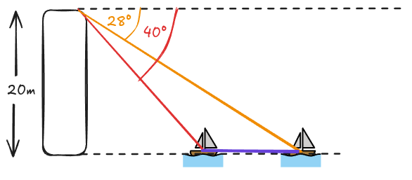

# Gemischte Aufgaben

## Aufgabe 1

:::snippet{#aufgabe}
Berechne die fehlenden Größen im rechtwinkligen Dreieck. Runde auf eine Nachkommastellen. Fertige zunächst eine Skizze an.
:::

:::multievent

|     | $\alpha$ | $\beta$     | $\gamma$    | $a$          | $b$          | $c$         |
| --- | -------- | ----------- | ----------- | ------------ | ------------ | ----------- |
| a   | 35°      | {z{55}}°    | 90°         | {z{3,4}} cm | {z{4,9}} cm | 6 cm        |
| b   | 90°      | {z{33,4}}° | {z{56,6}}° | 10 cm        | 5,5 cm       | {z{8,4}}cm |
| c   | {z{50}}° | 40°         | 90°         | {z{10}}cm  | {z{8,4}}cm  | 13 cm       |

:::

:::collapsible{title="Videoerklärung" id="988165"}

::youtube[title]{#BORpvpFj1So}

:::

## Aufgabe 2

:::snippet{#aufgabe}
Berechne die fehlenden Größen im rechtwinkligen Dreieck. Runde auf eine Nachkommastellen. Fertige zunächst eine Skizze an.
::: 

:::multievent

|     | $\alpha$ | $\beta$     | $\gamma$    | $a$         | $b$          | $c$          |
| --- | -------- | ----------- | ----------- | ----------- | ------------ | ------------ |
| a   | 42°      | {z{48}}°    | 90°         | {z{7,2}}cm | 8 cm         | {z{10,8}}cm |
| b   | 90°      | {z{48,6}}° | {z{41,4}}° | 12 cm       | 9 cm         | {z{7,9}}cm    |
| c   | {z{38}}° | 52°         | 90°         | {z{9,2}} cm | {z{11,8}} cm | 15 cm        |

:::

## Aufgabe 3

:::snippet{#aufgabe}
Eine Leiter lehnt an einer Wand. Die Leiter ist 5 Meter lang und steht in einem Winkel von 70° zur Wand. Berechne die Höhe, in der die Leiter die Wand berührt. Runde auf zwei Nachkommastellen. Fertige zunächst eine Skizze an.
:::

:::multievent

Die Leiter berührt die Wand in einer Höhe von {z{4,70}} Metern.

:::

:::collapsible{title="Videoerklärung" id="98810230165"}

::youtube[title]{#G1YkmUSwpYY}

:::

## Aufgabe 4

:::snippet{#aufgabe}
Ein Baum wirft einen Schatten von 8 Metern Länge. Der Winkel zwischen dem Boden und der Sonne beträgt 40°. Berechne die Höhe des Baumes. Runde auf zwei Nachkommastellen. Fertige zunächst eine Skizze an.
:::

:::multievent

Die Höhe des Baumes beträgt {z{6,71}} Meter.

:::

## Aufgabe 5

Von einem 20 Meter hohen Turm wird mit zwei Peilungen der Abstand zwischen zwei Schiffen auf dem Wasser bestimmt. Die Situation ist in der Skizze dargestellt.

:::snippet{#aufgabe}
Berechne den Abstand zwischen den beiden Schiffen. Runde auf zwei Nachkommastellen.
:::

:::multievent

Der Abstand zwischen den beiden Schiffen beträgt {z{13,77}} Meter.

:::

:::collapsible{title="Videoerklärung" id="98810230165isdaf"}

::youtube[title]{#xod30oYcDjc}

:::