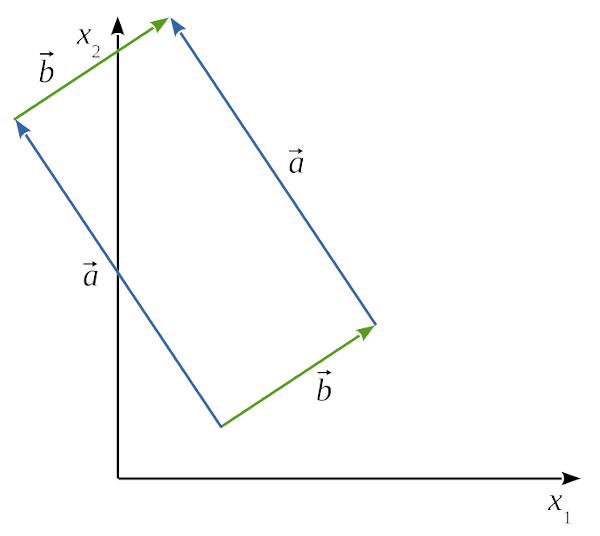

# Ausgangssituation

Folgendes Schaubild zeigt die Vektoren $$ \vec{a} = \begin{pmatrix}-4\\6\end{pmatrix} $$ und $$ \vec{b} = \begin{pmatrix}3\\2\end{pmatrix} $$.

## Forschungsauftrag

1. Beschreibe, welche Form von den Vektoren eingeschlossen wird.

:::collapsible{title="Lösung" id="205189"}

Rechteck

:::

2. Untersuche die Seiten, Diagonalen und Winkel der Figur.

:::collapsible{title="Lösung" id="438415"}

Die jeweils gegenüber liegenden Seiten sind gleich lang. Beide Diagonalen sind gleich lang. Alle Innenwinklen sind 90° groß.

:::

3. Bestimme die Vektoren, die den Diagonalen entsprechen.

:::collapsible{title="Lösung" id="058936"}

$$ \vec{d_1} = \vec{a} + \vec{b} = \begin{pmatrix}-4\\6\end{pmatrix} + \begin{pmatrix}3\\2\end{pmatrix} = \begin{pmatrix}-1\\8\end{pmatrix} $$

$$ \vec{d_2} = \vec{a} - \vec{b} = \begin{pmatrix}-4\\6\end{pmatrix} - \begin{pmatrix}3\\2\end{pmatrix} = \begin{pmatrix}-7\\4\end{pmatrix} $$

:::

## Schlussfolgerungen

Angenommen zwei Vektoren $$ \vec{a} $$ und $$ \vec{b} $$ gehen vom selben Punkt aus.

1. Gib an wie groß der Winkel ist, den $$ \vec{a} $$ und $$ \vec{b} $$ einschließen, wenn gilt: $$ | \vec{a} + \vec{b} | = | \vec{a} - \vec{b} | $$ (d.h. die Diagonalen gleich lang sind).

:::collapsible{title="Lösung" id="496174"}

90°

:::

2. Bringe die Umforumgen in die richtige Reihenfolge und vollziehe sie nach.

::h5p{src="./Umformungsschritte sortieren.h5p"}

# Transfer in den Raum

Gegeben sind die Punkte $$ P(5|4|10) $$, $$ Q(12|5|5,5) $$ und $$ S(3|9|8) $$.

::embed{src="https://www.geogebra.org/calculator/guc3zt3c?embed" height="600px"}

## Forschungsauftrag

1. Stelle eine Vermutung auf, ob die Vektoren $$ \vec{v} = \vec{PQ} $$ und $$ \vec{s} = \vec{PS} $$ orthogonal (senkrecht) zueinander sind ($$ \vec{v} \perp \vec{s} $$).
2. Bestimme die Vektoren $$ \vec{v} $$ und $$ \vec{s} $$.

:::collapsible{title="Lösung" id="878595"}

$$ \vec{v} = \begin{pmatrix}7\\1\\-4,5\end{pmatrix} $$
$$ \vec{s} = \begin{pmatrix}-2\\5\\-2\end{pmatrix} $$

:::

3. Übertrag die Schlussfolgerung aus dem zweidimensionalen Raum (siehe oben) auf den dreidimensionalen Raum und zeige rechnerisch am Beispiel von $$ \vec{v} $$ und $$ \vec{s} $$, dass die Bedingung ebenfalls gilt.

:::collapsible{title="Lösung" id="131317"}

$$ \vec{v} \cdot \vec{s} = \begin{pmatrix}7\\1\\-4,5\end{pmatrix} \cdot \begin{pmatrix}-2\\5\\-2\end{pmatrix}=7\cdot(-2)+1\cdot5+(-4,5)\cdot(-2)=0 $$

:::

# Definition

Das Produkt zweier Vektoren

$$ \vec{a} \cdot \vec{b} = \begin{pmatrix}a_1\\a_2\\\vdots\\a_n\end{pmatrix} \cdot \begin{pmatrix}b_1\\b_2\\\vdots\\b_n\end{pmatrix} = a_1 \cdot b_1 + a_2 \cdot b_2 + \dots + a_n \cdot b_n $$

heißt :t[Skalarprodukt]{#skalarprodukt}.

# Satz

::::snippet{#merken}
Zwei Vektoren $$ \vec{a} $$ und $$ \vec{b} $$ sind orthogonal zueinander $$ (\vec{a} \perp \vec{b}) $$, wenn

$$ \vec{a} \cdot \vec{b} = \dots $$

Ergänze die vorstehende Gleichung.

:::collapsible{title="Lösung" id="728917"}

$$ \vec{a} \cdot \vec{b} = a_1 \cdot b_1 + a_2 \cdot b_2 + \dots + a_n \cdot b_n = 0 $$

:::
::::
