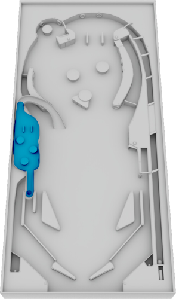

# Pinball 3D: Obere Ebene

Die obere Ebene des Spiels soll auch mit der Parameterform beschrieben werden. Die obere Ebene (blau markiert) verläuft parallel zur Tischebene und geht durch den Punkt $P(29|43|10)$. 

- Gib die Parameterform der oberen Ebenen an.

::::tabs{id="971965"}

:::tab{title="2D Visualisierung" id="003676"}

:::

:::tab{title="3D Visualisierung" id="886209"}

::geogebra{src="./pinball3d-obere-ebene.ggb" appName="3d" height="600"}

:::

::::

:::collapsible{title="Tipp" id="982897"}

Welche Eigenschaften haben zwei parallele Geraden? Kannst du Ähnliches für zwei parallele Ebenen beobachten?

:::
