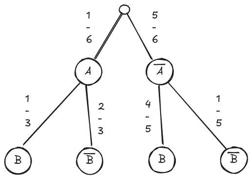

# Baum- und Mengendiagramme

Das Baumdiagramm beschreibt das Ziehen einer Kugel aus einer Urne mit Kugeln die von 1 bis 18 nummeriert sind.

## Aufgabe 1

:::snippet{#aufgabe}
Zeichne ein passendes Mengendiagramm zum Baumdiagramm.
:::

::excalidraw{aspectRatio="16/9" autoZoom=true center=true edit=true}

:::collapsible{title="Lösung"}
Es gibt mehrere Möglichkeiten, die Mengen A und B zu definieren. Eine mögliche Lösung ist:

<mengen-visualisierung
  readonly
  menge-a="2,3,1"
  menge-b="1,7,8,9,10,11,12,13,14,15,16,17,18"
  grundmenge="1,2,3,4,5,6,7,8,9,10,11,12,13,14,15,16,17,18"
  label-a="Ungerade Zahlen"
  label-b="Gerade Zahlen"
  label-grundmenge="G">
</mengen-visualisierung>
:::

## Aufgabe 2

::::multievent
:::snippet{#aufgabe}
Berechne die folgenden Wahrscheinlichkeiten als Dezimalzahlen. Runde auf zwei Nachkommastellen.

(1) $ P(A \cup B) $ = {z{0,67}}

(2) $ P(A \cap B) $ = {z{0,22}}

(3) $ P(\overline{A}) $ = {z{0,33}}

(4) $ P(\overline{A \cap B}) $ = {z{0,78}}

(5) $ P(\overline{A} \cup \overline{B}) $ = {z{0,33}}

(6) $ P(A \setminus B) $ = {z{0,44}}
:::
::::
